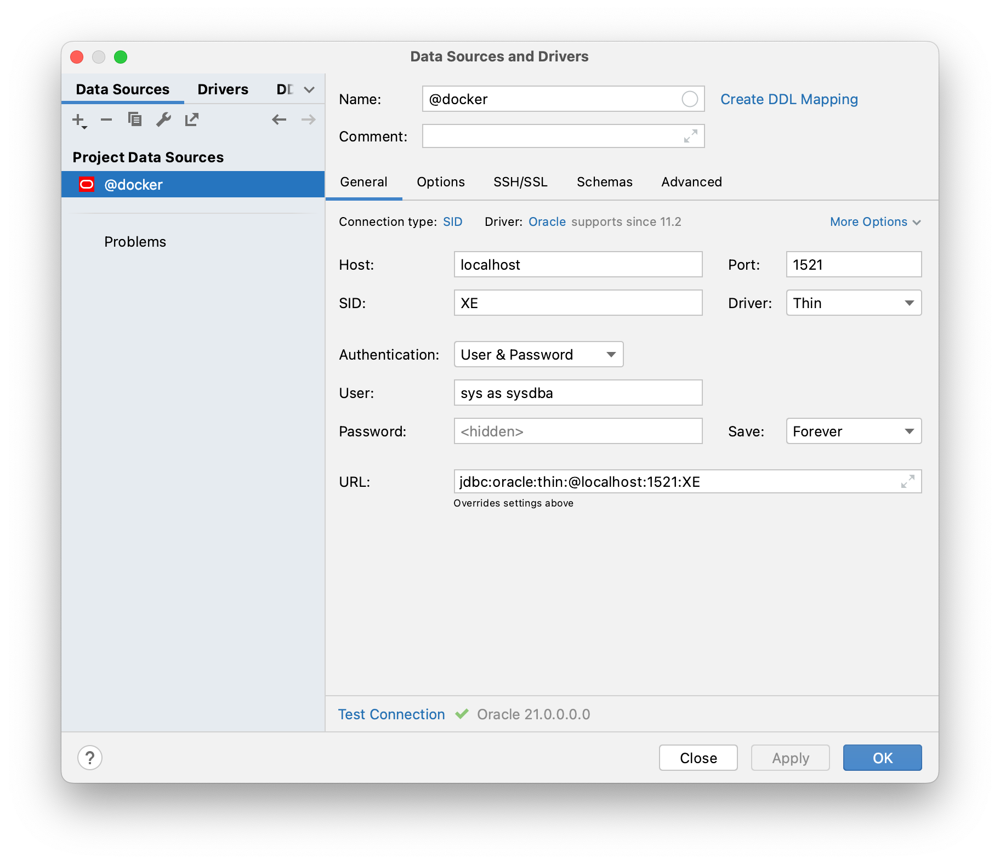

# Oracle 12c con Docker

Instrucciones y fichero de configuración para arrancar una base de datos Oracle 12c en local mediante Docker.

> ⚠️ Estas instrucciones solo sirven para Macs con procesador Intel; no funcionan en los M1 porque no hay versión
> de Oracle Database para arquitectura ARM64.

## Prerrequisitos

1. Instalar Docker Desktop para [Windows y macOS](https://www.docker.com/products/docker-desktop)
   o [Linux](https://docs.docker.com/desktop/linux/).

2. Instalar [Oracle SQL Developer](https://www.oracle.com/es/database/technologies/appdev/sql-developer.html) (requiere
   iniciar sesión con una cuenta de Oracle o crear una nueva si todavía no se dispone de una)
   o [JetBrains DataGrip](https://www.jetbrains.com/es-es/datagrip/) (requiere una suscripción).

3. En Windows, instalar [Scoop](https://scoop.sh) usando PowerShell:

   ```powershell
   [Net.ServicePointManager]::SecurityProtocol = [Net.SecurityProtocolType]::Tls12
   Invoke-Expression (New-Object System.Net.WebClient).DownloadString('https://get.scoop.sh')
   ```

   Y después instalar los comandos necesarios:

   ```powershell
   scoop install git make
   ```

4. Clonar este repositorio:

   ```shell
   git clone https://github.com/ijaureguialzo/oracle12c.git
   ```

## "Comprar" la imagen de Oracle Database en Docker Hub

1. Registrarse en [Docker Hub](https://hub.docker.com).
2. Buscar la imagen oficial
   de [Oracle Database Enterprise Edition](https://hub.docker.com/_/oracle-database-enterprise-edition).
3. Pulsar en `Proceed to Checkout` para _comprar_ la imagen (es _gratis_, a cambio de los datos personales, para
   desarrolladores).

> Siguiendo estos pasos, la imagen queda asociada a nuestra cuenta de Docker Hub, no hay que hacer nada más.

## Iniciar sesión en Docker Hub

1. Hacer click en el icono de Docker en la barra de estado e iniciar sesión con la cuenta de Docker Hub haciendo click
   en `Sign In / Create Docker ID`.
2. Iniciar sesión con el usuario y contraseña de Docker Hub creado en el apartado anterior.

## Arrancar la base de datos

1. En un terminal, situarse en la carpeta que contiene el fichero `docker-compose.yml`.
2. Arrancar el servidor:

   ```shell
   make start
   ```

3. Cuando haya arrancado (tarda unos minutos) aparecerá `(healthy)` en la salida del comando `docker ps`.

   > Para parar el servidor hay que utilizar el comando `make stop`.

## Datos de conexión

| Clave | Valor |
|---|---|
| Usuario | `sys` |
| Contraseña | `Oradoc_db1` |
| Tipo de conexión | Básico |
| Rol | `SYSDBA` |
| Host | `localhost` |
| Puerto | `1521` |
| SID | `ORCLCDB` |

## Script para crear usuario

Para crear un usuario _normal_ con el que trabajar, el fichero [crear_usuario.sql](crear_usuario.sql) contiene un script
que se puede adaptar y ejecutar estando conectado como `sys` al servidor.

## Conexión al servidor de base de datos

### Desde SQL Developer


### Desde DataGrip


